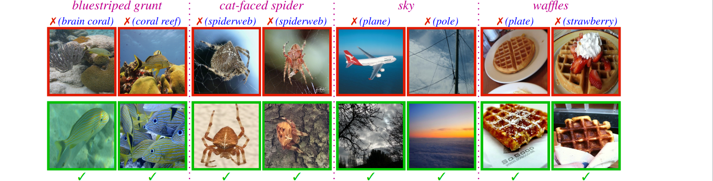
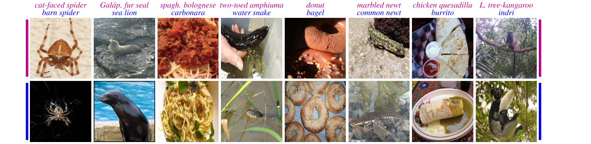

# Code for the **NINCO** OOD dataset introduced in
# [In or Out? Fixing ImageNet Out-of-Distribution Detection Evaluation](https://arxiv.org/abs/XXXX.XXXXX)

**Julian Bitterwolf\*, Maximilian Müller\*, Matthias Hein**

**University of Tübingen**  
**Tübingen AI Center**

\*Equal contribution

**[https://arxiv.org/abs/XXXX.XXXXX](https://arxiv.org/abs/XXXX.XXXXX)**

**Note: This is not the final version yet. Particularly the NINCO_popular_datasets_subsamples dataset will soon receive updates to include another five cleaned datasets.**

### Paper abstract

Out-of-distribution (OOD) detection is the problem of identifying inputs which are unrelated to the in-distribution task. The OOD detection performance when the in-distribution (ID) is ImageNet-1K is commonly being tested on a small range of test OOD datasets. We find that most of the currently used test OOD datasets have severe issues, in some cases more than 50\% of the dataset contains objects belonging to one of the ID classes.
These erroneous samples heavily distort the evaluation of OOD detectors. As a solution, we introduce with NINCO a novel test OOD dataset, each sample checked to be ID free, which with its fine-grained range of OOD classes allows for a detailed analysis of an OOD detector’s strengths and failure modes, particularly when paired with a number of synthetic “OOD unit-tests”.
We provide detailed evaluations across a large set of architectures and OOD detection methods on NINCO and the unit-tests, revealing new insights about model weaknesses and the effects of pretraining on OOD detection performance.

## The NINCO dataset

The **NINCO** (**N**o **I**mageNet **C**lass **O**bjects) dataset consists of 46 OOD classes with a total of 4293 samples.
The OOD classes were selected to have no categorical overlap with any classes of ImageNet-1K.
Then we inspected each sample individually to not contain ID objects.

### Examples of individual sorting decisions:


 **Top:** Samples that were excluded due to overlap with ID classes. **Bottom:** Samples from the same
OOD class that were included in the cleaned datasets.

### Examples images from some of the most difficult NINCO OOD classes

Examples from <span style="color:#BF008C"> NINCO OOD classes </span> (first row) and from the <span style="color:blue">ImageNet-1K class</span> (second row) which the <span style="color:BF008C"> OOD class </span> is most frequently confused for.

---

# **Using this repository**:

## NINCO dataset utilities and example notebooks for replicating the results of the paper 

This repository contains the evaluation pipeline for obtaining the results in the paper.
It was tested with the python package versions that are installed via `pip install -r versioned_requirements.txt`, though `pip install -r versioned_requirements.txt` should work as well (potentially using timm==0.6.11 for the same model checkpoints).


Five jupyter notebooks can in the current version be used as tutorials for the repo's functionalities:

 - **`plots_in_or_out_paper.ipynb`** opens the file `model_outputs/df.pkl` which contains most evaluation results shown in the paper. It can be modified in order to inspect individual evaluation numbers, e.g. the performance of a specific detector on a specific OOD class. These results can be accessed without downloading data or running models.
 - **`analyze_evaluations.ipynb`** shows example methods for examining results of such evaluations are shown in `analyze_evaluations.ipynb`.

---

## NINCO dataset download 
[To evaluate models and view the NINCO images, please download and extract this tar.gz file.](https://drive.google.com/file/d/1lR9ncSCyLH6uVb4jzfZtMRPg1YMiYQGt/view?usp=share_link)

--- 

## Run evaluations

Please edit `data/paths_config.py` to set `ninco_folder` to the folder where the downloaded datasets have been extracted (containing the folders `NINCO_OOD_classes`,  `NINCO_OOD_unit_tests` and  `NINCO_popular_datasets_subsamples`).
Also, set `repo_path` to the absolute path of this repository.

Models can be evaluated by running `evaluate.py`.

For example, the ViT-B-384-21k with MSP can be evaluated on the NINCO OOD classes with:

**`python evaluate.py --model_name vit_base_patch16_384_21kpre --dataset NINCO --method MSP`**

For other datasets, use `--dataset NINCO_popular_datasets_subsamples`, `--dataset NINCO_OOD_unit_tests`, or `--dataset file_list.csv` where `file_list.csv` has a header row, one column containing the image locations and an optional second column with labels, e.g. as in `data/NINCO_OOD_classes.csv`.

Specifying `--method all` evaluates all methods, but takes considerable time since it requires a forward pass over the whole ImageNet train set.

Example methods for examining results of such evaluations are shown in `analyze_evaluations.ipynb`.

## Citations:

When using **NINCO**, please consider citing (besides this paper) the following data sources that were used to create NINCO:

```
Hendrycks et al.: "Scaling out-of-distribution detection for real-world settings", ICML, 2022.
Bossard et al.: Food-101 – mining discriminative components with random forests", ECCV 2014.
Zhou et al.: "Places: A 10 million image database for scene recognition", IEEE PAMI 2017.
Huang et al.: "Mos: Towards scaling out-of-distribution detection for large semantic space", CVPR 2021.
The iNaturalist project: https://www.inaturalist.org/
```

When using **NINCO_popular_datasets_subsamples**, additionally to the above, please consider citing:

```
Cimpoi et al.: "Describing textures in the wild", CVPR 2014.
Hendrycks et al.: "Natural adversarial examples", CVPR 2021.
Wang et al.: "Vim: Out-of-distribution with virtual-logit matching", CVPR 2022.
```

For citing our paper, we would appreciate using the following bibtex entry:

```
@inproceedings{
bitterwolf2023ninco,
title={In or Out? Fixing ImageNet Out-of-Distribution Detection Evaluation},
author={Julian Bitterwolf and Maximilian Mueller and Matthias Hein},
booktitle={ICLR 2023 Workshop on Pitfalls of limited data and computation for Trustworthy ML},
year={2023},
url={https://openreview.net/forum?id=8K6FMDyBs2}
}
```